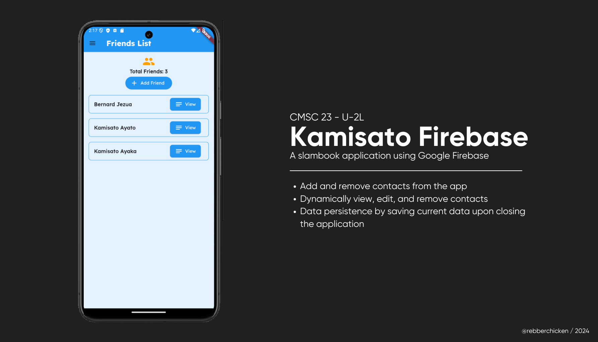

[](https://classroom.github.com/a/nvkeq4nA)

# Kamisato Records Using Google Firebase

## Code Description



This Flutter application is a modified version of the Kamisato Records ([link to repository](https://github.com/bernardjezua/kamisato-records)). It demonstrates data persistence using Google Firebase. It includes functionalities to add, retrieve, update, and delete data from the `kamisato-records` database. The application uses a `Provider` for state management.

## Features

- An improvement of the Kamisato Records [repository](https://github.com/bernardjezua/kamisato-records).
- Configured Firebase Firestore for data persistence.
- Dart files are organized to separate folders such as `api`, `models`, `navigation`, `providers`, and `screens`.
- Implemented `FriendListProvider` for state management.
- Used `context.watch` to check on `FriendListProvider` for any edit or delete actions. And `context.read` to call on the provider commands such as `addFriend`, `editFriend`, and `deleteFriend`.
- Created a user interface for adding, viewing, updating, and deleting records.
- Added error handling and validation for user inputs.

### How to Run Code
1. Open Command Prompt or Windows Powershell.
2. Navigate to the project directory.
3. Set up your Google Firebase Database and follow the steps.
4. Ensure you have FlutterFire CLI installed. If not, install it using:
    ```sh
    dart pub global activate flutterfire_cli
    ```
5. Configure FlutterFire for your project:
    ```sh
    flutterfire configure
    ```
6. Run the following lines to start the emulator and run the app:
    ```sh
    cd kamisato
    flutter emulator --launch "Pixel_API"
    flutter run
    ```

### Sample Run


## References

- Dbestech.com. (2023).  Flutter's addPostFrameCallback. https://www.dbestech.com/tutorials/flutter-addpostframecallback
- Ghimire, S.B. (2024, February 12). Understanding Flutter’s addPostFrameCallback: A Practical Guide. Medium; Medium. https://saw2110.medium.com/understanding-flutters-addpostframecallback-a-practical-guide-b3d3133b6b85
- Google. (2024). Tips & tricks | Cloud Functions for Firebase. Retrieved from: https://firebase.google.com/docs/functions/tips
- Gunawan, M. (2023, March 16). 4 Ways to Avoid The Null Check (!) Operator On Flutter. Retrieved from: https://mario-gunawan.medium.com/4-ways-to-avoid-the-null-check-operator-on-flutter-e2b8e7d965d
- Fireship.io. (2019). Top 100 Firebase Tips and Tricks. Retrieved from: https://fireship.io/lessons/firebase-tips-and-tricks/
- Rasathurai, S. (2024). Null check operator used on a null value. Retrieved from: https://stackoverflow.com/questions/64278595/null-check-operator-used-on-a-null-value